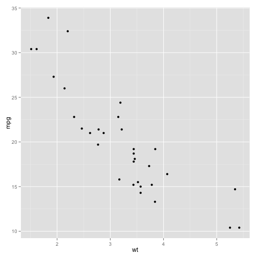

---
title : Red Media, Blue Media
author: MJ Cho
mode  : selfcontained
framework: impressjs
github:
  user: mjcho
  repo: COMM-272-slides
twitter:
  text: "Slidify with impress.js!"
url:
  lib: ../../libraries
--- .slide x:-1000 y:-1500

<script src="http://ajax.googleapis.com/ajax/libs/jquery/1.9.0/jquery.min.js"></script>
<script src="../../libraries/widgets/popcornjs/js/popcorn-complete.min.js"></script>
<script>
    function handleDomLoadedExtra() {
      var pop = Popcorn.vimeo(
        "player",
        "http://player.vimeo.com/video/41823197");
      var articles = document.getElementsByTagName('article');
      for (var i = 0; i < articles.length; ++i) {
        var article = articles[i];
        var timings = article.getAttribute("data-timings");
        if (timings != null) {
          var starts = timings.split(",");
          for (var j = 0; j < starts.length; ++j) {
            pop.code({
              start: parseInt(starts[j]),
              slideNumber: i,
              onStart: function(options) {
                impress.next();
              }
            });
          }
        }
      }
    };
    $(document).ready(function(){
      handleDomLoadedExtra();
    });
</script>

<div id="player" style="width: 160px; height: 120px"></div>


<q>Aren't you just **bored** with all those slides-based presentations?</q>

--- .slide x:0 y:-1500

<q>Don't you think that presentations given **in modern browsers** shouldn't **copy the limits** of 'classic' slide decks?</q>

--- .slide x:1000 y:-1500

<q>Would you like to **impress your audience** with **stunning visualization** of your talk?</q>

--- #title x:0 y:0 scale:4

<span class="try">then you should try</span>
# impress.js^*
<span class="footnote">^* no rhyme intended</span>

--- #its x:850 y:3000 rot:45 scale:5

 It's a **presentation tool** <br/>
inspired by the idea behind [prezi.com](http://prezi.com) <br/>
and based on the **power of CSS3 transforms and transitions** in modern browsers.

--- #big x:3500 y:2100 rot:180 scale:6

visualize your <b>big</b> <span class="thoughts">thoughts</span>

--- #tiny x:2825 y:2325 z:-3000 rot:300 scale:1

and **tiny** ideas

--- #ing x:3500 y:-850 rot:270 scale:6
by <b class="positioning">positioning</b>, <b class="rotating">rotating</b> and <b class="scaling">scaling</b> them on an infinite canvas

--- #imagination x:6700 y:-300 scale:6

the only **limit** is your <b class="imagination">imagination</b>

--- #source x:6300 y:2000 rot:20 scale:4

want to know more?

<q>[use the source](http://github.com/bartaz/impress.js), Luke</q>

--- #one-more-thing x:6000 y:4000 scale:2

one more thing...

--- #its-in-3d x:6200 y:4300 z:-100 rotx:-40 roty:-10 scale:2

<span class="have">have</span> <span class="you">you</span> <span class="noticed">noticed</span> <span class="its">it's</span> <span class="in">in</span> <b>3D<sup>*</sup></b>?

<span class="footnote">* beat that, prezi ;)</span>

--- #rstats x:-1000 y:5000


```r
library(ggplot2)
qplot(wt, mpg, data = mtcars)
```

--- x:-1500 y:5500


```
## Error in eval(expr, envir, enclos): object 'opts_chunk' not found
```

```
## Warning: package 'ggplot2' was built under R version 3.1.3
```

 


  
